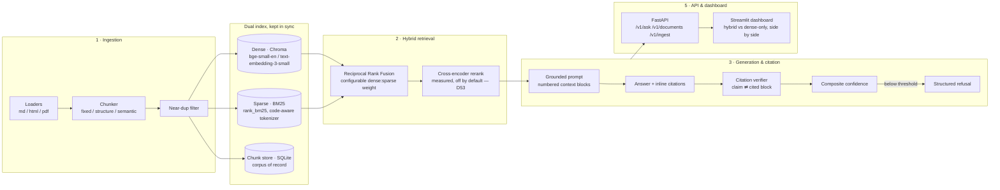

# HybridRAG

**A production-shaped RAG system over FastAPI's documentation** — dense vector search and
BM25 keyword search, fused with Reciprocal Rank Fusion, generating grounded answers with
inline citations that are independently verified against the source text.

Every claim in this README is a number from `evals/reports/`, reproducible by running the
scripts that produced it. Where a "smarter" technique was tried and didn't help — the
reranker, the RRF weight sweep — that's reported too, not hidden.

[](https://github.com/AnshChhikara001/hybridrag/actions/workflows/ci.yml)


---

## The problem

A support team, a new hire, or a developer with a question about a large technical corpus
does not want a search box that returns ten links — they want an answer, and they want to
know the answer isn't invented. That's the gap RAG closes, and it's also where most RAG
demos quietly cut corners: no evaluation, no citation checking, a single retrieval method
presented as if it were obviously sufficient.

This project uses FastAPI's own documentation (155 files, ~400K tokens, 797 unique
inline-code identifiers like `response_model` and `Depends`) as a stand-in for "a
company's internal docs" — technical enough that exact keyword match and semantic
similarity each win on different questions, which is the actual argument for hybrid
retrieval rather than an assumption.

## Architecture



**Six phases, built in order**, each gated on its own tests and evaluation before the next
started:

| Phase | What it does | Status |
|---|---|---|
| 1 · Ingestion & chunking | Multi-format loaders; three switchable chunkers (fixed / structure-aware / semantic); dense + sparse indexes built from the same chunks; document-scoped near-duplicate detection | ✅ complete |
| 2 · Reranking | Cross-encoder reranker built and measured on the golden set | ✅ closed — measured out, doesn't ship (D53) |
| 3 · Generation & citation | Grounded prompt, `[n]` inline citations, claim-level citation verification, composite confidence, structured "I don't know" | ✅ complete |
| 4 · Evaluation | Hand-verified 35-question golden set; Tier 1 (retrieval, deterministic) + Tier 2 (LLM-judged answer quality, judge validated against human labels) | ✅ complete |
| 5 · API & dashboard | FastAPI service with OpenAPI docs; Streamlit dashboard showing hybrid-vs-dense-only side by side | ✅ complete |
| 6 · Portfolio polish | This README, architecture diagram, numbers-first case study | ✅ this document |

## Key technical decisions

Full rationale for all 55 decisions — including the ones that didn't make this cut — lives
in [`docs/PROJECT_STATE.md`](docs/PROJECT_STATE.md). The ones that shape the system most:

| Decision | Why |
|---|---|
| **Corpus: FastAPI's own docs** (D1) | 797 unique inline-code identifiers give BM25 a genuine, measured chance to beat dense retrieval — the project's core thesis, not an assumption. |
| **Fusion reads ranks, never scores** (D20) | BM25's scores are unbounded and corpus-dependent; cosine sits in [-1, 1]. Min-max normalizing per query would make the fused rank depend on each list's spread, not its relevance. RRF sidesteps that entirely. |
| **The reranker was built, measured, and did not ship** (D52, D53) | Paired bootstrap on the golden set: no interval separates reranked-hybrid from plain hybrid, and the point estimate on the default chunking arm is a net *loss* (Recall@5 −0.069). Reported as a negative result rather than shipped for the demo's sake. |
| **RRF weights are configurable and swept; the 1:1 default stays** (D54) | The brief requires the fusion weight to be tunable. Swept 0.25:1 to 4:1 — Recall@5 is flat from 0.5:1 to 4:1, so the simplest default is also the justified one. |
| **Citation verification uses a negative control** (D47) | A judge model grading citations is worthless unless it's shown to discriminate. Cited (real) blocks score 0.900 supported; random blocks from the same corpus score 0.050 — a 0.85 separation with a confidence interval that excludes zero. That's what licenses trusting the 0.900 number at all. |
| **The correctness judge is validated against human labels before being trusted** (D37) | `gpt-5-mini` reaches κ = 0.730 against 20 hand-adjudicated verdicts. A cheaper judge (`gpt-5-nano`) was tried first and measured **indistinguishable from chance** (κ = 0.007) — disqualified by measurement, not by assumption. |
| **Generation provider is a `.env` override, not a code default** (D55) | Gemini's free tier is genuinely free but paces the whole process to 5 requests/minute; the dashboard doubles the request load per question (hybrid + dense-only, concurrently). Switching the *default* would silently cost a clean checkout money. `HYBRIDRAG_GENERATION_PROVIDER=openai` opts in explicitly; an unconfigured checkout still runs on Gemini at $0. |
| **Dashboard talks to the API over HTTP, never imports the library directly** | Keeps the dashboard a true client of the service being demonstrated — the same contract any real consumer would use — and keeps Streamlit out of the API's own dependency tree. |

## Evaluation

All numbers below are reproducible: `uv run scripts/evaluate_retrieval.py` (Tier 1, $0,
seconds) and `uv run scripts/evaluate_answers.py` (Tier 2, needs an API key, served from a
persistent response cache so a re-run costs $0 unless the corpus or prompt actually
changed).

### Retrieval (Tier 1 — deterministic, no LLM)

29 scored questions (lookup / multi-hop / ambiguous), 95% bootstrap intervals, hybrid vs.
dense vs. sparse, on the winning chunking strategy (`fixed`, 512-token chunks):

| arm | Recall@5 | Recall@10 | nDCG@10 |
|---|---|---|---|
| **hybrid** | **0.897** [0.793, 1.000] | 0.897 | **0.794** |
| dense only | 0.828 [0.690, 0.966] | 0.897 | 0.742 |
| sparse only | 0.793 [0.621, 0.931] | 0.897 | 0.779 |

Hybrid beats sparse alone with a confidence interval that excludes zero on
Recall@token-budget (+0.138 [+0.034, +0.276]); hybrid vs. dense is a real trend (88–96%
probability of improvement across metrics) but at 29 questions doesn't yet clear 95%
significance on every metric — reported as a trend, not oversold as proven.
Full report: [`evals/reports/retrieval.md`](evals/reports/retrieval.md).

### Answer quality (Tier 2 — LLM-judged, judge validated against 20 human labels)

| arm | correct | correct or partial | grounded | cited honestly |
|---|---|---|---|---|
| hybrid | 0.943 [0.857, 1.000] | 1.000 | 1.000 | 1.000 |
| dense only | 0.943 [0.857, 1.000] | 0.971 | 1.000 | 1.000 |

Full report: [`evals/reports/answers.md`](evals/reports/answers.md).

### Citation verification — does the cited block actually support the claim?

Structural citation checking (does `[3]` point at a real block?) is necessary but not
sufficient — a citation can resolve perfectly and still be attached to a sentence the
block never actually supports. This project checks that directly, per claim, against a
negative control:

| pairing | supported rate |
|---|---|
| cited blocks (real) | 0.900 |
| random blocks (control) | 0.050 |
| **separation** | **+0.850** [+0.725, +0.950] |

6 of 56 cited claims across the golden set were caught not holding up — each one listed by
question ID in [`evals/reports/citation_verification.md`](evals/reports/citation_verification.md),
not averaged away.

### The negative result: reranking

A cross-encoder reranker (`ms-marco-MiniLM-L-6-v2`, ONNX via `fastembed`) was built,
wired into the pipeline, and measured with the same paired-bootstrap methodology as
everything else. It does not separate from plain hybrid retrieval on this corpus, and on
the default chunking arm the point estimate is a **net loss** (Recall@5 −0.069). Leading
explanation: RRF already fuses two complementary signals (BM25 exact-match on 797 code
identifiers + dense semantic similarity), and a general-purpose MS MARCO cross-encoder is a
third, weaker opinion precisely on the queries where lexical match already wins. It is not
in the default path. Full report: [`evals/reports/reranker.md`](evals/reports/reranker.md).

## Cost

**Ceiling: $1.00. Spent: ~$0.29** — tracked line-by-line in
[`docs/PROJECT_STATE.md`](docs/PROJECT_STATE.md#budget). Every Tier 1 retrieval report
re-runs at **$0** (no LLM involved at all — deterministic metrics only). Every Tier 2 /
citation-verification report re-runs at **$0** once cached; the dollar figures above are
priced from token counts so they stay meaningful even when a run is entirely cache hits.

The dashboard's live per-question cost, on the default `gpt-5-mini` generation provider:
**~$0.0023 per question** (both hybrid and dense-only answers together).

## Quickstart

Requires Python 3.12+ and [`uv`](https://docs.astral.sh/uv/).

```bash
git clone https://github.com/AnshChhikara001/hybridrag.git
cd hybridrag
uv sync --locked
cp .env.example .env   # fill in GEMINI_API_KEY (free) — see below
```

**Get a free Gemini API key** at [aistudio.google.com/apikey](https://aistudio.google.com/apikey) —
no card required. That's the only key needed to run everything end to end at $0.

```bash
# 1. Fetch the corpus (pinned FastAPI docs release) and build the indexes
./scripts/fetch_corpus.sh
uv run python scripts/build_index.py data/raw/fastapi/docs/en/docs --embedder local

# 2. Ask a question from the CLI
uv run python scripts/ask.py "how do I add a dependency with Depends"

# 3. Run the API
uv run uvicorn hybridrag.api.app:app --reload
# → OpenAPI docs at http://localhost:8000/docs

# 4. Run the dashboard (separate process, talks to the API over HTTP)
uv run --group dashboard streamlit run dashboard/app.py
# → http://localhost:8501

# 5. Reproduce the evaluation numbers above
uv run python scripts/evaluate_retrieval.py     # Tier 1 — $0
uv run python scripts/evaluate_answers.py       # Tier 2 — needs an API key, cached after first run
```

Run the tests: `uv run pytest -m "not slow"` (580+ tests; `slow` tests download a real
embedding model and are excluded from CI for that reason, not because they're skipped —
run `uv run pytest` for the full suite).

## What I built and learned

- **Measured, not asserted, architecture.** Every "hybrid beats dense" or "reranking
  helps" claim in a typical RAG README is a vibe. Here it's a paired bootstrap with a
  reported confidence interval, run the same way for the wins and the loss (the reranker).
- **A citation system that checks itself.** Citation *resolution* (does `[3]` point at a
  real block) is the easy 80%. This project also checks citation *support* — does the
  cited text actually say the claim — against a negative control, so the 0.900 number
  means something instead of being a judge rubber-stamping its own prompt.
- **Judge validation before trusting a judge.** Two LLM judges were tried for answer
  correctness; the cheaper one was measured statistically indistinguishable from chance
  (κ = 0.007) and disqualified before it could quietly inflate every downstream number.
- **Config over code for a cost-sensitive default.** Switching the generation provider
  live during the dashboard build (D55) via an environment variable, not a code change,
  meant the fix was reversible and a clean checkout's behavior never silently changed.

## Limitations

- **29 answerable golden questions.** Confidence intervals are wide at this sample size —
  reported rather than hidden, but real: several apparent wins do not clear 95%
  significance, and are described as trends, not proof.
- **Citation coverage is 0.525, not 1.0.** The generator doesn't attribute every sentence
  to a source; roughly half of claims go uncited. Precision on what *is* cited is high
  (0.917), but coverage is the honest number to quote, not precision alone.
- **Single corpus, single domain.** Every number here is FastAPI-docs-specific. The
  identifier-dense nature of API documentation is exactly what makes hybrid retrieval's
  case measurable — a prose-only corpus would likely show a smaller (or no) hybrid
  advantage, and that's a testable claim this project doesn't itself test.
- **The reranker's negative result is one cross-encoder, one corpus.** It doesn't
  generalize to "reranking never helps" — it generalizes to "measure before you ship it."
- **No deployment.** This is a portfolio project run locally; it is not hosted, and the
  Docker phase named in the original brief was not built (see
  [`docs/PROJECT_STATE.md`](docs/PROJECT_STATE.md) for what's built vs. what's next).

## Project structure

```
src/hybridrag/
  loaders/        markdown / html / pdf → a common Document model
  chunking/        fixed / structure-aware / semantic strategies
  indexing/        dense (Chroma) + sparse (BM25) index builders, dedup
  retrieval/        RRF fusion, hybrid retriever, cross-encoder reranker
  generation/        prompt, answerer, citation verifier, confidence, refusal
  evaluation/        golden set, metrics, LLM judge, statistical harness
  api/              FastAPI app (/v1/ask, /v1/documents, /v1/ingest)
dashboard/          Streamlit UI — a client of the API, not a library import
scripts/            CLI entry points (build_index, ask, evaluate_*, sweep_rrf_weights)
evals/              golden set, judge labels, generated reports
docs/               PROJECT_STATE.md (full decision log), project-brief.md
tests/              580+ tests, mirroring src/ layout
```

## Security notes

- No secrets are committed. `.env` is gitignored; `.env.example` documents every variable
  with no real values. Verified against the full git history, not just the working tree.
- All uploaded/ingested documents (`POST /v1/ingest`) are validated: extension allowlist,
  empty-file rejection, and the upload filename is reduced to its basename before being
  joined to a directory path, closing the path-traversal route a raw filename would open.
- CI runs with `permissions: contents: read` — the workflow can check out and test code,
  and nothing else.

## License

[MIT](LICENSE) — the corpus this project indexes (`fastapi/fastapi` docs) is itself MIT
licensed.
